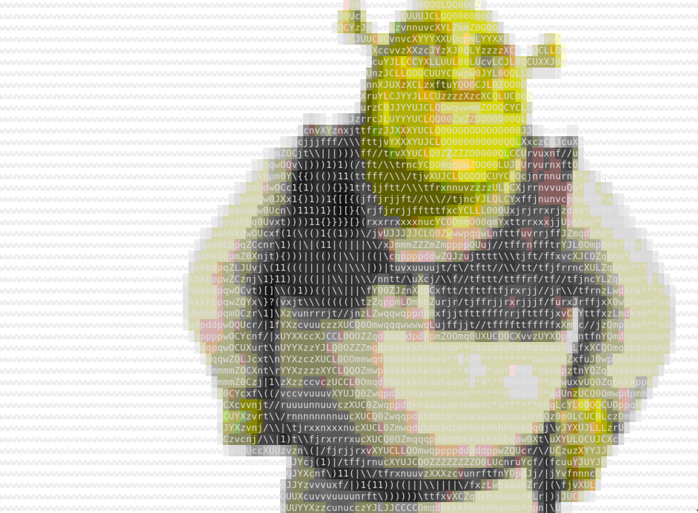
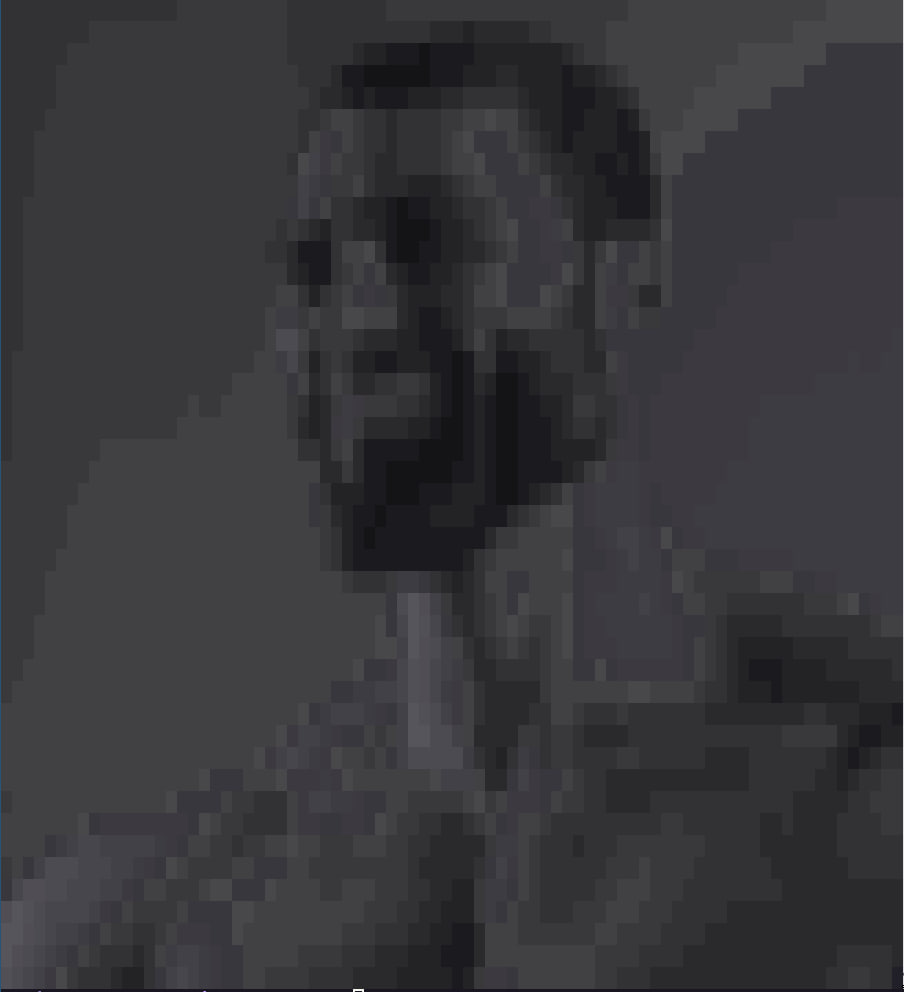
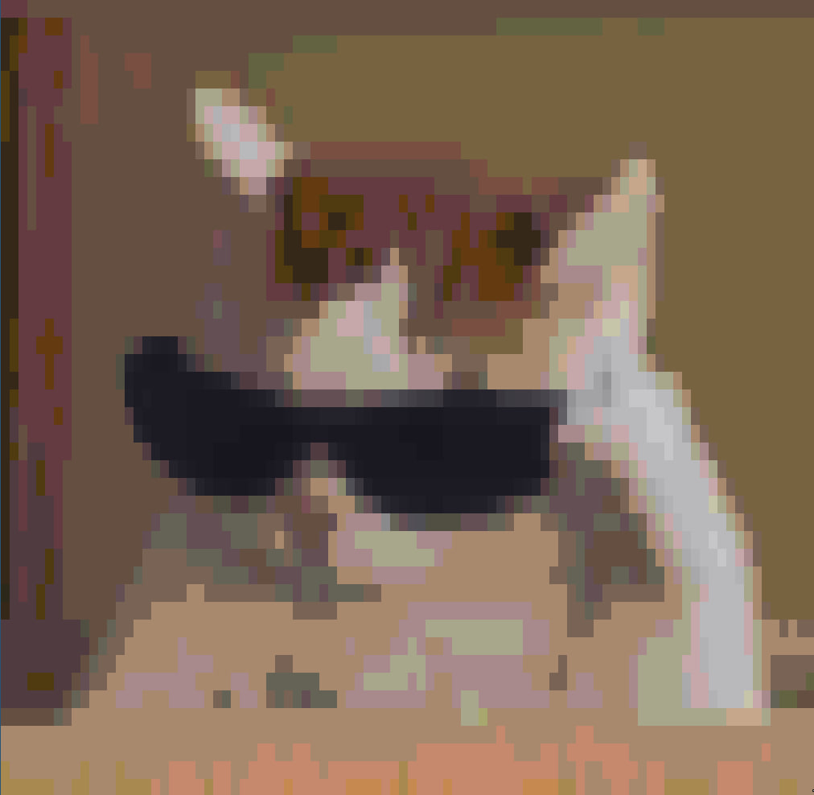

# IMAGE2TEXTART
This is rust implementation of image to ascii(textart)

# Usage:

**Arguments:**

- `<FILENAME>`: Path to the image file.

**Options:**

- `-W, --width <WIDTH>`: Specifies the width of the output image.
- `-H, --height <HEIGHT>`: Specifies the height of the output image.
- `-r, --ratio <RATIO>`: Specifies the scale of the image. [default: 1]
- `-c, --color <COLOR>`: Specifies the colors to be used in the output image. [default: gray]
- `-C, --charset <CHARSET>`: Specifies the symbols to be used to render the output image, ranging from translucent to opaque. Built-in charsets: ansi, default, slight. [default: default]
- `--custom-charset <CUSTOM_CHARSET>`: Specifies custom characters to be used to render the output image.
- `-i, --invert`: Inverts the weights of the characters. Useful for white backgrounds.
- `-h, --help`: Prints the help message (see a summary with '-h').
- `-V, --version`: Prints the version number.

# Examples:

## Shrek:

## Gigachad:

## Cool Cat:

